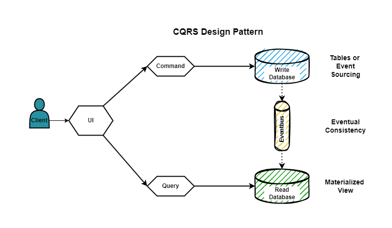

## bank-account-api
Spring Boot demo application showcasing CQRS/Event Sourcing with Axon Framework and Axon Server.

 

 

### Description
This project demonstrates CQRS (Command Query Responsibility Segregation) and Event Sourcing patterns using the Axon Framework and Axon Server.

What is CQRS? 
CQRS is a pattern that separates commands (write operations) from queries (read operations). By decoupling these two aspects of an application, CQRS helps to scale and optimize each operation independently.

What is Event Sourcing? 
Event Sourcing is a pattern where state changes are stored as a sequence of events rather than as direct updates to the application's state. This approach provides a complete audit trail of all changes and enables rebuilding the current state by replaying events.

Axon Framework 
Axon Framework is a powerful library for implementing CQRS and Event Sourcing in Java applications. It provides abstractions for handling commands, events, and queries, and simplifies the development of scalable and maintainable systems.

Axon Server 
Axon Server is a dedicated server for managing commands, events, and queries. It handles event storage, query management, and provides a centralized hub for the CQRS infrastructure.

 

Features of This Project
* CQRS Implementation: Demonstrates how to separate command and query responsibilities.
* Event Sourcing: Shows how to use events to capture state changes.
* Axon Framework Integration: Utilizes Axon Framework to manage commands, events, and queries.
* Axon Server Setup: Includes instructions for setting up and connecting to Axon Server.

 

### Getting Started

In order to run and test the application, see details on [How to run?](src/main/resources/docs/how_to_run.md) and [How to test?](backend/src/main/resources/docs/how_to_test.md) sections.

 

### Dependencies

* Spring Boot
* Spring Web
* Spring Data JPA
* Axon Framework
* Lombok
* H2 Database

 

### Documentation
For further reference, please consider the following sections:

* [Spring Boot](https://docs.spring.io/spring-boot/docs/current/reference/htmlsingle/)
* [Spring Data JPA](https://docs.spring.io/spring-data/jpa/docs/current/reference/html/)
* [Command Query Responsibility Segregation (CQRS)](https://microservices.io/patterns/data/cqrs.html)* 
* [Axon Framework](https://www.axoniq.io/products/axon-framework)
* [Axon Server](https://www.axoniq.io/products/axon-server)

 

### Guides
The following guides illustrate how to use some features concretely:

* [Building a RESTful Web Service](https://spring.io/guides/gs/rest-service/)
* [Serving Web Content with Spring MVC](https://spring.io/guides/gs/serving-web-content/)
* [Building REST services with Spring](https://spring.io/guides/tutorials/rest/)
* [Accessing Data with JPA](https://spring.io/guides/gs/accessing-data-jpa/)

 

### Additional Links
These additional references should also help you:

* [Gradle Build Scans – insights for your project's build](https://scans.gradle.com#gradle)

 

### Version History

* v1.0.0 Initial Release

 
 

