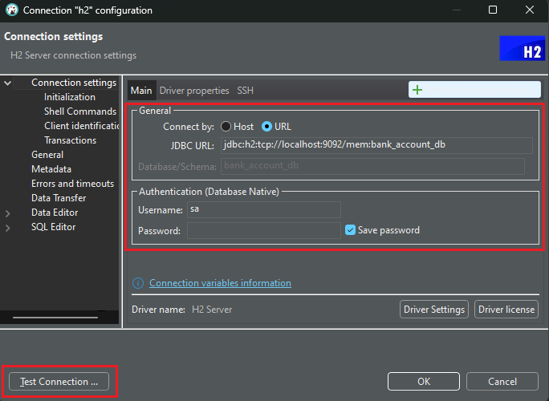
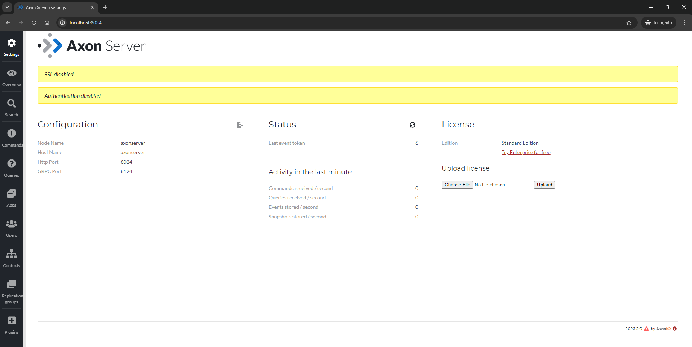
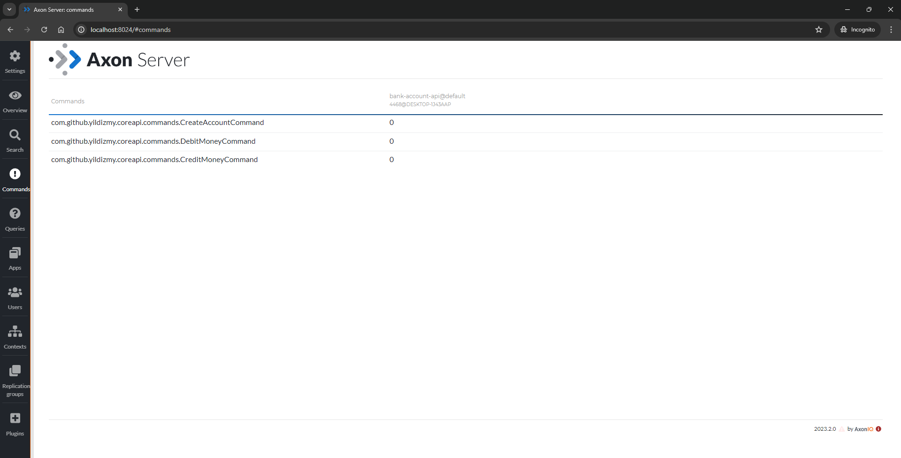
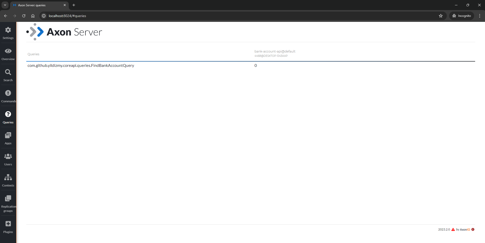
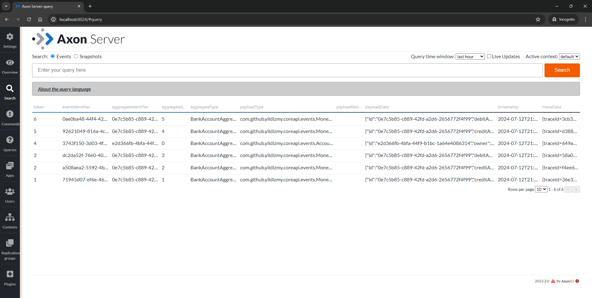

## How to test?

### Open API (Swagger) UI

For Open API (Swagger) Documentation UI and the endpoints, open http://localhost:8080/swagger-ui/index.html after running the app.

<br/>

### Postman Collection

The [Postman Collection](postman/bank-account-api.postman_collection.json) shared in the resources can be modified and used for testing the endpoints.

<br/>

### API Endpoints

> [!NOTE]
> All URIs are relative to *http://localhost:8080/api/v1*

<br/>

| Class              | Method                                                                               | HTTP request                         | Description                                              |
|--------------------|--------------------------------------------------------------------------------------|--------------------------------------|----------------------------------------------------------|
| *AccountCommandController* | [**createAccount**](http://localhost:8080/api/v1/accounts)                           | **POST** /accounts                   | Creates a new account using the given request parameters |
| *AccountCommandController* | [**creditMoneyToAccount**](http://localhost:8080/api/v1/accounts/credit/{accountId}) | **PUT** /accounts/credit/{accountId} | Credits money to the given account                       |
| *AccountCommandController* | [**debitMoneyFromAccount**](http://localhost:8080/api/v1/accounts/debit/{accountId}) | **PUT** /accounts/debit/{accountId}  | Debits money from the given account                      |

<br/>
<br/>

| Class                   | Method                                                                                              | HTTP request                         | Description                                                                                  |
|-------------------------|-----------------------------------------------------------------------------------------------------|--------------------------------------|----------------------------------------------------------------------------------------------|
| *AccountQueryController* | [**findById**](http://localhost:8080/api/v1/accounts/{id})                                      | **GET** /accounts/{accountId}               | Retrieves a single account by the given id                                                   |
| *AccountQueryController* | [**listEventsForAccount**](http://localhost:8080/api/v1/accounts/{accountId}/events) | **GET** /accounts/{accountId}/events | Retrieves all events for the given account |

<br/>
<br/>


### Connecting to H2 database

In order to connect to the H2 database using DBeaver, IntelliJ IDEA, etc. the following url can be used:

```
jdbc:h2:tcp://localhost:9092/mem:bank_account_db
```



<br/>
<br/>


### Connecting to Axon Server UI

After starting the application container on Docker, Axon Server UI will be reachable on http://localhost:8024/.



<br/>

Click on Commands menu to list the executed commands:



<br/>

Then, in order to list the queries, click on Queries menu:



<br/>

We can see all the events in the Search section. Click on Search button on the Search section to grab all events:



<br/>
<br/>


### Unit & Integration Tests
Unit Tests will be provided later in the corresponding packages.

<br/>
<br/>